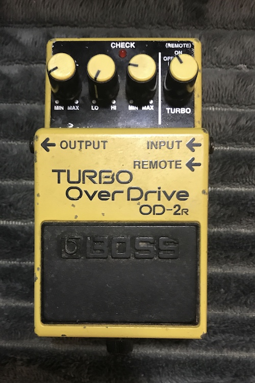
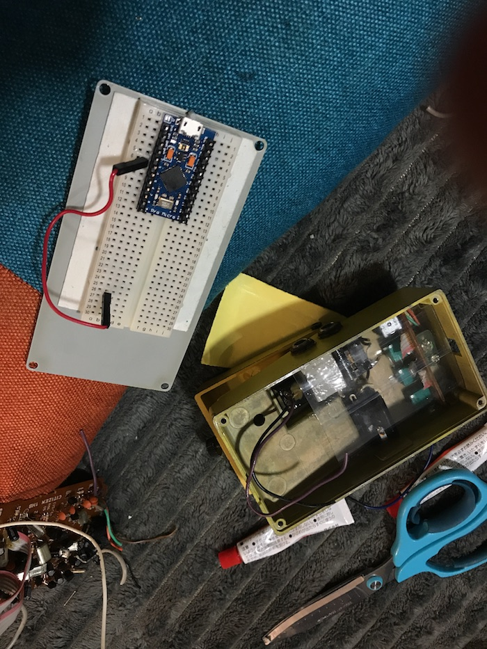
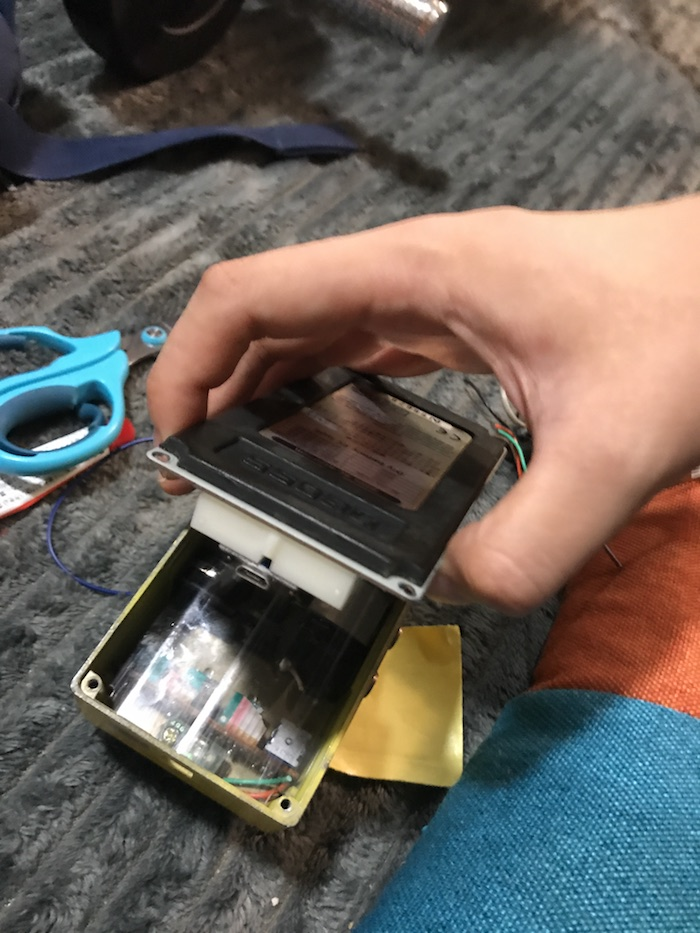
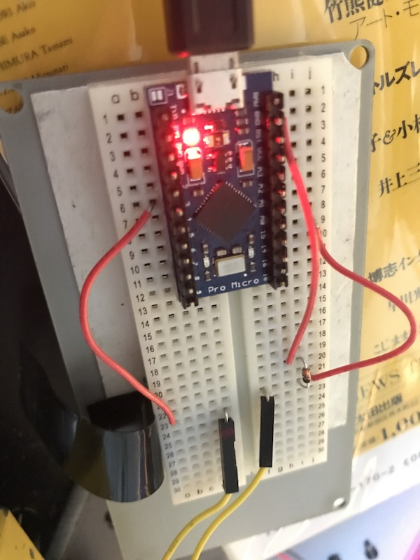
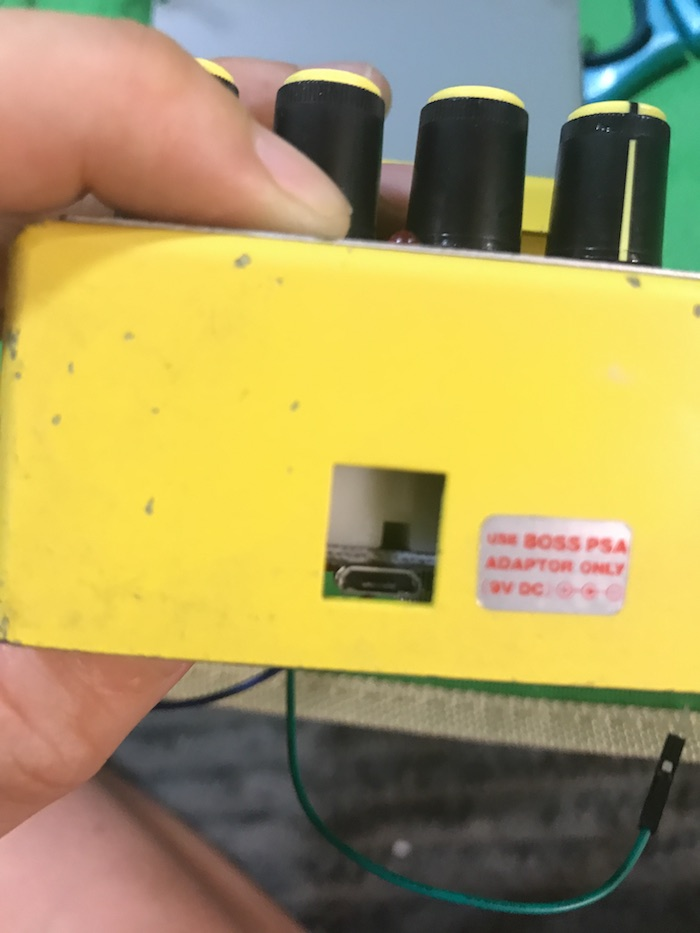
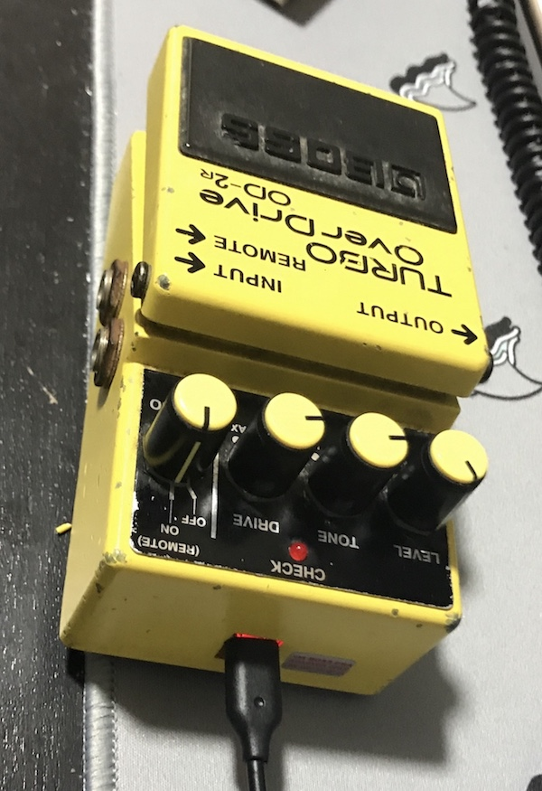

# Vim pedalを作る

腕はたかだか二本しか無い。しかし我々にはまだ足が残されている。

## あらすじ

私はVimを使っている。VimというエディタはとにかくEscキーを多用する。
そして私には足が二本ある。プログラミングをするときにこの足を使わないのはもったいないのではないか。
ではフットペダルをEscキーとして使うのはどうか。どうせなら自作したい。
そこで少し調べたところ、BOSSのコンパクトエフェクターにはモメンタリスイッチを採用しているものがいくつかあった。
モメンタリの2pinスイッチなら簡単にコンピュータの入力デバイスにできるはずだと踏んで、ジャンクのBOSS TURBO OVERDRIVE OD-2Rを1000円ほどでフリマアプリで購入した。



そして、これを改造してEscキーを割り当てる事にした。

## 分解

いらなさそうな部品を引っ剥がす。BOSSの基板が出てくる。なんか勿体無い。



スイッチに付いているワイヤだけ残しておく。
補強のためスイッチ周りをエポキシ樹脂で固める。
干渉防止の為クリアファイルをカットしたものを挟む。




## 配線・はんだ付け

スイッチについているワイヤをブレッドボードに刺せるタイプのワイヤと結合させる。
pro microをピンヘッダにはんだ付けして、ブレッドボードに刺す。
ワイヤとダイオードを適当に配線する。
Arduino IDE for Macで一応動作確認をしておく。



## qmkの焼き込み

[qmk_firmware/keyboards/handwired/onekey](https://github.com/qmk/qmk_firmware/tree/master/keyboards/handwired/onekey) を流用する。

keymapは `KC_ESC` にしておく。シンプル。
今回は組み立て上の都合でconfig.hの `MATRIX_COL_PINS` をB1に変更した。

```c
#define MATRIX_COL_PINS {  B1 }
#define MATRIX_ROW_PINS {  D0 }
```

## 組み立て

pro microがついたブレッドボードを粘着テープでエフェクターの蓋の裏側に貼り付ける。





びっくりするほどきれいにmicro USBの穴とフィットする。

## 動作確認

繋げてvimを起動、INSERTモードへ移行、ペダルを踏む。
無事NORMALモードに移行された。

## 使ってみて

普通に使える。
元の箱の用途が用途だけに、耐久性も安心。
バネが重いので、足が鍛えられてしまう。バネを切るなどの調整が必要そう。
TRRSジャック経由で複数個エフェクターを繋げてEsc以外（Shift, Enterなど）を割り当てても面白そうだな。
